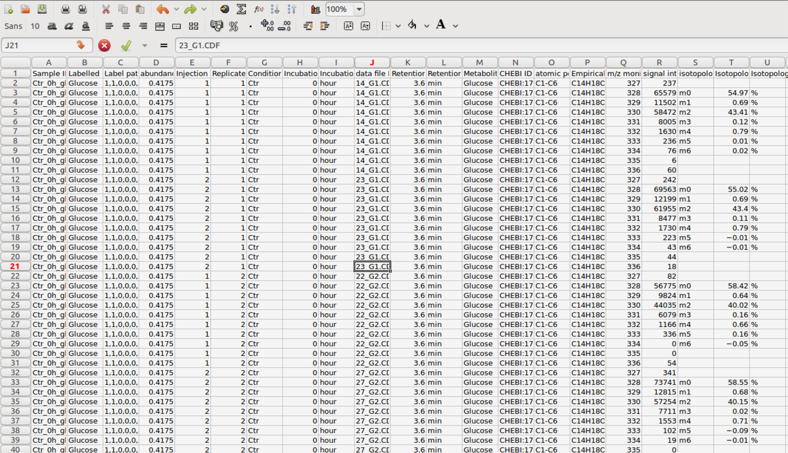

# MIDcor
Version: 1.0
## Short Description

“R”-program that corrects 13C mass isotopomers spectra of metabolites for naturally occurring isotopes and peaks overlapping

<a name="contents"></a>
## Contents

1. [Description](#1)
2. [Functions](#2)
3. [Ways of using the code](#3)
4. [Execution the program](#4)

<a name="1"></a>
## 1. Description

Midcor is an “R”-program designed for correcting raw data, obtained for metabolites of interest using Gas Cromatography coupled with Mass Spectrometry (GCMS). It corrects for naturally occurring isotopes and peaks overlapping the raw 13C MID, obtained e.g. by applying programs [Ramid](https://github.com/phnmnl/phenomenal-h2020/wiki/Ramid) or [Cdf2mid](https://github.com/phnmnl/phenomenal-h2020/wiki/Cdf2mid) to the data saved by mass spectrometers. In this way it supports an important part of workflow of 13C tracing data analysis leading to evaluation of intracellular metabolic fluxes in central metabolism. The corrected MID originated from substrates that are artificially enriched with 13C then can be used for simulations of steady state ([Iso2Flux](https://github.com/cfoguet/iso2flux)) or dynamic ([Isodyn](https://github.com/seliv55/isodyn)) conditions. To this end the program performs a correction for naturally occurring isotopes and also correction for “impurities” of the assay media that give peaks overlapping with the spectra of analyzed labeled metabolites. This program offers two ways of corrections of “impurities” resulted from overlapping the assayed mass isotopomer distribution with peaks produced either by unknown metabolites in the media, or by different fragments produced by the assayed metabolite [1](https://www.ncbi.nlm.nih.gov/pubmed?term=midcor%20selivanov&cmd=correctspelling). 

## Key features

- primary processing of 13C mass isotopomer data obtained with GCMS

## Functionality

- Preprocessing
- Statistical Analysis
- Workflows

## Approaches

- Isotopic Labelling Analysis / 13C
    
## Instrument Data Types

- MS

<a name="2"></a>
## 2. Functions: correction of raw MID

- correction for H+ loss produced by electron impact
- correction for natural occurring isotopes
- correction for peaks overlapping

## Screenshots

- screenshot of input data (format Metabolights), output is the same format with one more column added: corrected mass spectrum



## Tool Authors

- Vitaly Selivanov (Universitat de Barcelona)

## Container Contributors

- [Pablo Moreno](EBI)

## Website

- N/A

## Git Repository

- https://github.com/seliv55/midcor

<a name="3"></a>
## 3. Ways of accessing the program

- Way 1. Accessing Midcor code directly, downloading it from [the GitHub repository](https://github.com/seliv55/midcor).

```sh
git clone https://github.com/seliv55/midcor
```
 Optionally a library of R-functions "midcor" can be created
```sh
 cd <'path to the directory'/>midcor
 sudo R
 library(devtools)
 build()
 install()
```
- Way 2. Using docker image of midcor.<br>
 The image can be pulled from repo:
```sh
 docker pull container-registry.phenomenal-h2020.eu/phnmnl/midcor
```
or installed locally using a local copy of [this repo](https://github.com/phnmnl/container-midcor):
```sh
 git clone https://github.com/phnmnl/container-midcor
 cd <'path to the directory'>/container-midcor
 docker build -t midcor .
```
Here to create the docker image, the same github repository "https://github.com/seliv55/midcor" is used.

<a name="4"></a>
## 4. Execution the program

- Direct execution of the downloaded code.<br>
  Enter in R environment, load the necessary libraries or/and, as an option, read the code directly:
```sh
 R
 library(midcor) # optionally, if this library was created (if not, use the option below)
 source("<'path to the directory'>/R/midcor.R") # if the library 'cdf2mid' was not installed
 source("<'path to the directory'>/R/lib.R")    # if the library 'cdf2mid' was not installed
```
Then run the main program:
```sh
 run_midcor(infile=<input file>, outfile<output file>, mode=<"con" or "var">)
```
 
## two examples provided

 MIDcor uses as input the file prepared by RaMID or Cdf2mid: 
 
```
 run_midcor(infile="ramidout.csv", outfile="midcorout.csv",mode="con") 
 run_midcor(infile="cdf2midout.csv", outfile="midcorout.csv",mode="con") 
``` 

- To run midcor as a docker image, created locally, go to a folder, containing the input data, and run the image:
```sh
docker run -it -v $PWD:/data midcor -i /data/<input.csv> -o /data/<output.csv> 
```
To run midcor as a docker image created in the PhenoMeNal repository, execute
```sh
docker run -it -v $PWD:/data container-registry.phenomenal-h2020.eu/phnmnl/midcor -i /data/<input.csv> -o /data/<output.csv>
```
 
Using the atomic composition of the metabolites, derivatized for gas chromatography, and known natural isotopes composition, MIDcor corrects for naturally occurring isotopes the raw spectra, extracted by RaMID from the CDF files. Moreover, it corrects the possible overlapping of peaks belonging to different substances, as described in [1]. File "midcorout.csv" contains all the data presented in "../RaMID/ramidout.csv" corrected. Further analysis, performed with Iso2flux or Isodyn, consists in simulations of the corrected mass spectra for the specific conditions of the given experiment. "midcorout.csv" can contain data referred to several conditions, e.g. the corrected file produced from CDF collection archived in "roldan.zip" includes data obtained from three cell lines. Since separate simulations needed to reproduce the spectra corresponding to each cell line, MIDcor also separates the data of "midcorout.csv" into the corresponding three files: "A549", "BEAS2B", "NCI". Each of these files is prepared for the subsequent simulation with Iso2flux or Isodyn.

## Publications
- [1] Selivanov VA, Benito A, Miranda A, Aguilar E, Polat IH, Centelles JJ, Jayaraman A, Lee PW, Marin S, Cascante M. MIDcor, an R-program for deciphering mass interferences in mass spectra of metabolites enriched in stable isotopes. BMC Bioinformatics. 2017, 18:88.


